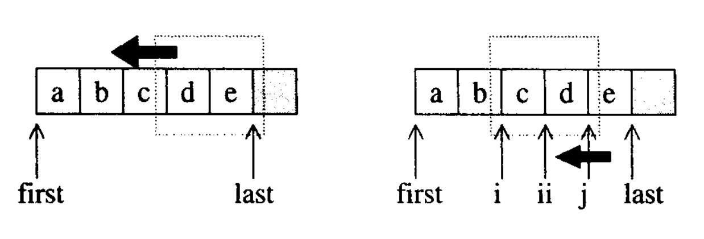

# 算法

```txt
  01-generalize_test.cpp:泛化的例子
  numeric:关于数值算法的代码
    01-numeric_test.cpp:几个数值算法的运用实例
    02-accumulate.cpp:求和
    03-adjacent_difference.cpp:区间内相邻元素差值
    04-inner_product.cpp:两个区间对应位置乘积
    05-partial_sum.cpp:前n项和
    06-power.cpp:计算x的n幂次方
    07-itoa.cpp:让区间内呈现从value递增的状态
  numeric_base:numeric中常用的算法代码
    01-numeric_base_test.cpp:运用实例
    02-equal.cpp:比较区间内容
    03-fill.cpp:指定范围内填充指定值
    04-fill_n.cpp:从起始位置开始的n个元素填充指定值
    05-iter_swap.cpp:将两个ForwardIterators所指的对象对调
    06-lexicographical_compare.cpp:以字典排列方式对两个序列进行比较
    07-max.cpp:取大
    08-min.cpp:取小
    09-mismatch.cpp:比较两个序列，指出第一个不匹配点
    10-swap.cpp:交换两个对象内容
    11-copy.cpp:拷贝
    12-copy_test.cpp:测试不同情况下调用不同的拷贝函数
  set:关于集合的相关算法
    01-set_test.cpp:运用实例
    02-set_union.cpp:并集
    03-set_intersection.cpp:交集
    04-set_difference.cpp:差集
    05-set_symmetric_difference.cpp:对称差集
  other_algo:其他的算法
    simple：一些简单算法
      01-test.cpp:算法测试
      02-adjacent_find.cpp:相邻元素间关系
      03-count.cpp:计数
      04-find.cpp:查找
      05-for_each.cpp:遍历区间内元素
      06-generate.cpp:将仿函数结果赋给区间元素
      07-includes.cpp:判断区间包含关系
      08-max_min_element.cpp:返回空间最大/最小元素
      09-merge.cpp:合并两个有序空间
      10-partition.cpp:重排列
      11-remove.cpp:删除的相关操作
      12-replace.cpp:替换
      13-reverse.cpp:倒序
      14-rotate.cpp:前后两块交换
      15-search.cpp:区间查找
      16-swap_ranges.cpp:区间交换
      17-transform.cpp:生成新区间
      18-unique.cpp:删相同的元素
    01-test.cpp:测试代码
    02-lower_bound.cpp:查找插入位置
    03-binary_search.cpp:二分查找
    04-next_permutation.cpp:前后的排列组合
    05-random_shuffle.cpp:随机重排列
    06-partial_sort.cpp:部分排序
    07-sort.cpp:排序
    08-equal_range.cpp:二分查找
    09-inplcae_merge.cpp:原地合并
    10-nth_element.cpp:部分排序
    11-mergesort.cpp:排序
```

## 1. 概述

算法：以有限的步骤，解决逻辑或数学问题

### 1.1. 算法分析与复杂度

- 算法分析：
  - 计算该算法所使用的空间和时间资源的操作
- 一般情况执行时间与处理数据量有关
  - 一般为一次、二次、三次、对数
  - 固定时间为O(1)
- 复杂度标记法
  - Big-Oh：常用,但不适合用来标记小数据量的情况
  - Big-Omega
  - Big-Theta
  - Little-Oh

### 1.2. STL算法总览

|算法名称|算法用途|质变?|所在文件|
|--|--|--|--|
|accumulate|元素累计|否|<stl_numeric.h>|
|adjacent_difference|相邻元素的差额|是if in-place|<stl_numeric.h>|
|adjacent_find|查找相邻而重复(或符合条件)的元素|否|<stl_algo.h>|
|binary_search|二分查找|否|<stl_algo.h>|
|Copy|复制|是if in-place|<stl_algobase.h>|
|Copy_backward|逆向复制|是if in-place|<stl_algobase.h>|
|Copy_n *|复制n个元素|是if in-place|<stl_algobase.h>|
|count|计数|否|<stl_algo.h>|
|count_if|再特定条件下计数|否|<stl_algo.h>|
|equal|判断两个区间是否相等|否|<stl_algobase.h>|
|equal_range|试图再有序区间中寻找某值|否|<stl_algo.h>|
|fill|改填元素值|是|<stl_algobase.h>|
|fill_n|改填元素值(n次)|是|<stl_algobase.h>|
|find|循序查找|否|<stl_algo.h>|
|find_if|循序查找符合特定条件的|否|<stl_algo.h>|
|find_end|查找某个子序列的最后一次出现点|否|<stl_algo.h>|
|find_first_of|查找某些元素的首次出现点|否|<stl_algo.h>|
|for_each|对区间内的每个元素施行某操作|否|<stl_algo.h>|
|generate|以特定操作的运算结果填充特定区间的元素|是|<stl_algo.h>|
|generate_n|以特定操作的运算结果填充n个元素内容|是|<stl_algo.h>|
|includes|是否涵盖于某序列中|否|<stl_algo.h>|
|inner_product|内积|否|<stl_numeric.h>|
|inplace_merge|合并并就地替换|是|<stl_algo.h>|
|Iota *|在某区间填入某指定值的递增序列|是|<stl_numeric.h>|
|is_heap *|判断某区间是否为一个heap|否|<stl_algo.h>|
|is_sorted *|判断某区间是否已排序|否|<stl_algo.h>|
|iter_swap|元素互换|是|<stl_algobase.h>|
|lexicographical_compare|以字典顺序进行比较|否|<stl_numeric.h>|
|lower_bound|“将指定元素插入区间内而不影响区间原本的排序”的最低位置|否|<stl_algo.h>|
|max|最大值|否|<stl_algobase.h>|
|max_element|最大值的位置|否|<stl_algo.h>|
|merge|合并两个序列|是if in-place|<stl_algo.h>|
|min|最小值|否|<stl_algobase.h>|
|min_element|最小值的位置|否|<stl_algo.h>|
|mismatch|找出不匹配点|否|<stl_algobase.h>|
|next_permutation|获得下一个排列组合|是|<stl_algo.h>|
|nth_element|重新安排序列中的第n个元素的左右两端|是|<stl_algo.h>|
|partial_sort|局部排序|是|<stl_algo.h>|
|partial_sort_copy|局部排序并复制到它处|是if in-place|<stl_algo.h>|
|partial_sum|局部求和|是if in-place|<stl_numeric.h>|
|partition|分割|是|<stl_algo.h>|
|prev_permutation|获得前一个排列组合|是|<stl_algo.h>|
|power *|幂次方，可指定表达式|否|<stl_numeric.h>|
|random_shuffle|随机重排元素|是|<stl_algo.h>|
|random_sample *|随机取样|是if in-place|<stl_algo.h>|
|random_sample_n *|随机取样|是if in-place|<stl_algo.h>|
|remove|删除某类元素|是|<stl_algo.h>|
|remove_copy|删除某类元素并将结果复制到另一个容器|是|<stl_algo.h>|
|remove_if|有条件地删除某类元素|是|<stl_algo.h>|
|remove_copy_if|有条件地删除某类元素并将结果复制到另一个容器|是|<stl_algo.h>|
|replace|替换某类元素|是|<stl_algo.h>|
|replace_copy|替换某类元素，并将结果复制到另一个容器|是|<stl_algo.h>|
|replace_if|有条件地替换|是|<stl_algo.h>|
|replace_copy_if|有条件地替换，并将结果复制到另一个容器|是|<stl_algo.h>|
|reverse|反转元素次序|是|<stl_algo.h>|
|reverse_copy|反转元素次序并将结果复制到另一个容器|是|<stl_algo.h>|
|rotate|旋转|是|<stl_algo.h>|
|rotate_copy|旋转，并将结果复制到另一个容器|是|<stl_algo.h>|
|search|查找某个子序列|否|<stl_algo.h>|
|search_n|查找连续发生n次的子序列|否|<stl_algo.h>|
|set_difference|差集|是if in-place|<stl_algo.h>|
|set_intersection|交集|是if in-place|<stl_algo.h>|
|set_symmetric_difference|对称差集|是if in-place|<stl_algo.h>|
|set_union|并集|是if in-place|<stl_algo.h>|
|sort|排序|是|<stl_algo.h>|
|stable_partition|分割并保持元素的相对次序|是|<stl_algo.h>|
|stable_sort|排序并保持等值元素的相对次序|是|<stl_algo.h>|
|swap|交换|是|<stl_algobase.h>|
|swap_ranges|交换指定区间|是|<stl_algo.h>|
|transform|以两个序列为基础，交互作用产生第三个序列|是|<stl_algo.h>|
|unique|将重复的元素折叠缩编，使其成为唯一|是|<stl_algo.h>|
|unique_copy|将重读的元素折叠缩编，使其成为唯一，并复制到其他地方|是if in-place|<stl_algo.h>|
|upper_bound|“将指定元素插入区间内而不影响区间的原本排序”的最高位置|否|<stl_algo.h>|
|make_heap|制造一个heap|是|<stl_heap.h>|
|pop_heap|从heap取出一个元素|是|<stl_heap.h>|
|push_heap|将一个元素推进heap中|是|<stl_heap.h>|
|sort_heap|对heap排序|是|<stl_heap.h>|

### 1.3. 质变算法(mutating algorithms)

- 会改变操作对象的值
- STL的算法作用在迭代器[first,last)的区间内
  - 质变算法会改变区间内的元素内容
  - 例如：拷贝、互换、替换、填写、删除、排列组合、分割、随即重排、排序...

### 1.4. 非质变算法(nonmutating algorithms)

- 不改变操作对象的值
  - 例如：查找、匹配、计数、巡访、比较、寻找极值...

### 1.5. STL算法的一般形式

- 所有的泛型算法的前两个参数都是一对迭代器指向区间[first,last)
- STL的算法声明都表现出它所需要的最低程度的迭代器类型
  - STL有五类迭代器，前面讲了他们的关系
  - 将无效的迭代器给算法，不一定会在什么时期被捕抓
- STL算法不一定只支持一个版本
  - 可能是一个基础的，其他的再添加一些限制条件，或者额外参数
- 质变算法通常提供两个版本：
  - 一个是in-place版，就地改变其操作对象
  - 另一个是copy版，将操作对象的内容复制一个副本，改好后返回该副本(通常以_copy为函数名的结尾)
- 所有的数值算法都实现于<stl_numeric.h>之中
  - 这是个内部文件，必须包含上层的< numeric >
- 其他STL算法实现于<stl_algo.h>和<stl_algobase.h>之中
  - 他们也是内部文件，需要包含< algorithm >

## 2. 算法的泛化过程

- 将算法独立于其所处理的数据结构之外，不受数据结构的羁绊
- 泛化
  - 把操作对象的型别加以抽象化
  - 把操作对象的标示法和区间目标的移动行为抽象化
  - 整个算法也就在一个抽象层面上工作了
- 几乎所有的东西都可以改写为程序员自定义的形式或行为

## 3. 数值算法

- 数值算法都包含表头< numeric >,SGI将它实现于<stl_numeric.h>

### 3.1. accumulate

- 用来计算init和[first,last)内所有元素的总和
- 必须要有一个init，目的是当传进来的区间为空时能获得一个明确的值
- 里面的二元操作符不需要满足交换率和结合律

### 3.2. adjacent_difference

- 用来计算[first, last)中相邻元素的差额
  - 将 第i号元素-第i-1号元素 的值 赋给 第i-1号元素

### 3.3. inner_product

- 计算[first1,last1) 和 [first2, first2+(last1-first1)) 的内积
  - 区间2的大小必须大于等于区间1的大小

### 3.4. partial_sum

- 用来计算局部总和
  - 就是前n项求和

### 3.5. power

- 专属于SGI，用来计算某数的n幂次方
  - n幂次方：自己对自己进行某种运算，达到n次
  - 运算类型可由外界指定

### 3.6. itoa

- 专属于SGI，
  - 用来设定某个区间的内容，使其内的每个元素从指定的value开始，呈递增状态
  - 属于质变算法

## 4. 基本算法

- 常用的一些算法，包含在<stl_algobase.h>

### 4.1. equal

- 比较两个区间的内容是否相同，会有一些问题

### 4.2. fill

- 指定范围内填充指定值

### 4.3. fill_n

- 从起始位置开始的n个元素填充指定值
- 返回的迭代器执行被填入的最后一个元素的下一个位置
- 但是可能会超越容器的大小，造成不可预期的错误
  - 解决：使用inserter()产生一个具有插而非覆写能力的迭代器

### 4.4. iter_swap

- 将两个ForwardIterators所指的对象对调

### 4.5. lexicographical_compare

- 以字典排列(直接看ASCII码)方式对两个序列进行比较
  - 对应位置比较
  - 结束：
    - 有对应位置元素不等
    - 同时达到两区间边界
    - 到达某一区间边界
  - 结果：
    - 第一区间小，返回true
    - 到达第一区间边界，返回true
    - 同时到达两区间边界，返回false

### 4.6. max

- 取两个对象中的较大值

### 4.7. min

- 取两个对象中的较小值

### 4.8. mismatch

- 比较两个序列，指出第一个不匹配点
  - 返回一对迭代器(pair)，分别指向他们第一个不匹配的点
- 如果第一序列比第二序列的元素多，会发生不可预的错误

### 4.9. swap

- 交换两个对象的内容

### 4.10. copy

- 复制操作
  - 将输入区间[first,last)内的元素复制到输出区间[result, result+(last-first))内
    - 输入区间和输出区间叠加情况需要酌情考虑使用copy()还是copy_backward()
  - 返回迭代器指向输出区间的end
- 复制操作的两个方法
  - 运用assignment operator(copy就是用它)
  - 运用copy constructor


- 有些元素型别拥有的是trivial assignment operator
  - 如果能够使用内存直接复制行为就能节省很多时间(memmove或memcpy)
  - 为了达到目的，SGI STL用了很多方法
    - 函数重载
    - 型别特性
    - 偏特化

- copy更改的是输出区间中迭代器所指的对象
  - 并不会更改迭代器本身
  - copy不能将元素插入到空容器中

### 4.11. copy_backward

- 它与copy几乎完全一样
  - 区别：它是逆向复制，copy是正向复制

## 5. set相关算法

- STL提供了四种集合相关的算法
  - 并集(union)
  - 交集(intersection)
  - 差集(difference)
  - 对称差集(symmetric difference)
- 这四个算法可接受set/multiset容器
  - 就是元素要有序，可以重复
- 接受的参数至少为4个，表示两个空间
- 元素允许重复与不允许重复结果会有些许差异的
- 元素有序是这些算法的前提
- 使用这些算法都需要包含< algorithm >

### 5.1. set_union

- 并集
- 返回迭代器，指向尾端
- 对于multiset的元素，如果两个区间内分别存在m、n个，那么结果区间内它的数量是max(m, n)
- 输入区间的相对顺序不会改变

### 5.2. set_intersection

- 交集
- 对于multiset的元素，如果两个区间内分别存在m、n个，那么结果区间内它的数量是min(m, n)

### 5.3. set_difference

- 差集
- 对于multiset的元素，如果两个区间内分别存在m、n个，那么结果区间内它的数量是max(m-n, 0)

### 5.4. set_symmetric_difference

- 对称差集
- 构造出集合 (S1-S2)U(S2-S1)
- 对于multiset的元素，如果两个区间内分别存在m、n个，那么结果区间内它的数量是|m-n|

## 6. heap算法

- 四个heap算法在STL_container的heap中已经学过了
  - make_heap()
  - pop_heap()
  - push_heap()
  - sort_heap()
- 包含在头文件<stl_heap.h>中，它包含于<stl_algo.h>中

## 7. 其他算法

### 7.1. 简单的数据处理算法

- 单纯的数据移动、线性查找、计数、循环遍历、逐一对元素进行指定的运算操作。

#### 7.1.1. adjacent_find

- 找出第一组满足条件的相邻元素

#### 7.1.2. count

- 计数
- 与value相等的元素的个数

##### 7.1.2.1. count_if

- 条件计数

#### 7.1.3. find

- 查找

##### 7.1.3.1. find_if

- 条件查找

##### 7.1.3.2. find_end

- 查找一个空间在另一个空间内最后一次出现的位置
- 没有就返回第一个空间的last

##### 7.1.3.3. find_first_of

- 查找一个空间中某元素在另一个空间第一次出现的位置
- 有一个元素在这个空间中出现过就可以

#### 7.1.4. for_each

- 遍历区间内元素
- 仿函数f施行于区间内每个元素
  - f不可改变元素的内容(因为first、last都是InpputIterators)

#### 7.1.5. generate

- 将仿函数gen的运算结果写到区间内所有元素身上

##### 7.1.5.1. generate_n

- 将仿函数gen的运算结果写道迭代器从first开始的n个元素身上

#### 7.1.6. includes

- 判断序列二是否涵盖于序列一
  - 序列有序、可重复
  - 涵盖：序列中的每个元素都在另一个序列中
- 根据序列的排序方式可以有两种操作

#### 7.1.7. max_element/min_element

- 返回空间的最大的元素
- 返回空间的最小的元素

#### 7.1.8. merge

- 将两个空间合并到另一空间
- 要求元素有序

#### 7.1.9. partition

- 元素重排列，符合条件放在前面，不保留原始相对位置

#### 7.1.10. remove

- 移除与value相等的元素
  - 但是它并没有真正的删除，而是将不与value相等的元素向前移动
  - 它内部是调用remove_copy的，它返回的还是这个容器

##### 7.1.10.1 remove_copy

- 它是将结果复制到另一个以result标示的起始位置的容器

##### 7.1.10.2. remove_if

- 带条件删除

##### 7.1.10.3. remove_copy_if

- 带条件删除并复制到另一空间

#### 7.1.11. replace

- 用新值替换旧值

##### 7.1.11.1. replace_copy

- 将结果复制到另一空间

##### 7.1.11.2. replace_if

- 带条件

##### 7.1.11.3. replace_copy_if

- 带条件并复制

#### 7.1.12. reverse

- 颠倒排序

##### 7.1.12.1. reverse_copy

- 颠倒排序并复制

#### 7.1.13. rotate

- 区间内部分成两部分，然后前后互换位置

##### 7.1.13.1. rotate_copy

- 结果复制到其他区域

#### 7.1.14. search

- 查找区间1在区间2首次出现的位置

##### 7.1.14.1. search_n

- 查找区间1内连续n个符合条件的元素形成的子序列
- 返回的是指向子序列起始处的迭代器

#### 7.1.15. swap_ranges

- 将[first1,last1)区间内的元素与first2开始相同长度的元素交换位置
- 可能发生错误
  - first2开始的区间长度小于区间1
  - 两个区间重叠
- 返回迭代器指向第二序列中最后一个被交换元素的下一个位置

#### 7.1.16. transform

- 通过仿函数作用于一个或两个区间产生一个新区间

#### 7.1.17 unique

- 移除相邻的重复的元素
  - 他如果不是排序好的可能会导致有些重复元素没有被移除

##### 7.1.17.1. unique_copy

- 带复制

### 7.2. lower_bound

- 二分查找的一个版本
- 在已排序的区间查找元素value，有就返回迭代器指向第一个元素，没有就返回指向value可以插入的位置

#### 7.2.1. upper_bound

- 返回value可以插入的位置(不管区间内有没有value)

### 7.3. binary_search

- 二分查找
- 它里面就是利用lower_bound找到位置，然后利用该位置的值与所求值做对比

### 7.4. next_permutation

- 用来计算排列组合关系的算法
- 排列组合：
  - 序列{a,b,c}有六种排列组合abc,acb,bac,bca,cab,cba
  - 按照字典序排列，abc是第一个，acb次之，cba最后
  - 按照上面的规则，可以给序列中的字符排序
  - 按照上面的顺序，可以计算字符的下(上)一个排列组合
- 会使得序列按规则排列组合，如果有就返回true，无就返回false



- 算法逻辑：
  - 从尾端开始向前寻找两个相邻元素
  - 令第一个元素为*i，第二个元素为 *ii，且满足 *i<*ii
  - 再从尾端开始向前检查，找到第一个大于*i 的元素 *j
  - 将i，j元素对调，再将ii之后的所有元素颠倒排列
  - 就得到了下一个排列

#### 7.4.1. prev_permutation

- 排列组合的前一个

### 7.5. random_shuffle

- 将区间元素次序随机重排列(!!!随机重排)

### 7.6. partial_sort/partial_sort_copy

- 接受一个在[first,last)中的迭代器middle，然后重新安排[first,last)
  - 使得序列中的middle-first个最小元素以递增顺序排列并置于[first,middle)中
  - 其余元素置于后半部，并不保证原相对顺序

### 7.7. sort

- 排序很重要
  - RB-tree底层的容器已自动排序
  - stack、queue、priority-queue有特定的出入口
  - vector、deque可以使用
  - list、slist不可以使用
- 限定条件：该算法需要接受两个RandomAccessIterator

- 当数据量大时使用Quick Sort(递归排序)
- 当数据量小后为了避免递归带来的额外负荷，使用Insertion Sort
- 如果递归层次过深就是用Heap Sort

#### 7.7.1. Insertion Sort

- 以双层循环的形式进行
  - 外循环遍历整个序列，每次迭代决定出一个子区间
  - 内循环遍历子区间，将子区间的每一个逆转对倒转过来
    - 逆转对：任何两个迭代器i,j 若i<j 而 *i>*j
- 不再存在逆转对，则排序完毕
- 复杂度为O(N^2)
- 适合处理少量数据

#### 7.7.2. Quick Sort

- 适合处理大量数据
  - 平均复杂度是O(NlogN)的最坏是O(N^2)
- 算法简述
  - S代表将要被处理的序列
  - 如果S的元素个数为0或1，结束
  - 取S中的任何一个元素，当作枢轴v
  - 将S分割为L，R两段，使L内的每一个元素都小于或等于v，R内的每一个元素都大于或等于v
  - 对L,R 递归执行Quick Sort
- 三点中值(Median-of-Three)
  - 任何元素都可以当作枢轴，但是太过不合适的会影响Quick Sort的效率，为了避免元素输入的不够随机带来的恶化效应
  - 最理想最稳当的方式是取整个序列的头、尾、中央三个位置的元素，以其中值作为枢轴
- 分割(Partitioining)
  - 令头端迭代器first向尾部移动，尾端迭代器last向头端移动
  - 当*first大于或等于枢轴时就停下来，当 *last小于或等于枢轴时也停下来
  - 如果两个迭代器相对位置仍为first左last右，就交换迭代器的元素，然后向中央逼近
  - 如果他们相对位置改变，则调整完毕，以first为轴将序列分开进行递归操作
- 阈值(threshold)
  - 当序列很小的时候就使用Insertion Sort以提高效率
  - 阈值就是序列多小算小
- final insertion sort
  - 将某个大小以下的序列停在马上就要排序成功的状态，然后再用一个Insertion Sort将他们排序完成
  - 这样比把所有的子序列彻底排序好要效率高
- introsort
  - 内省式排序
  - 它的行为在大部分情况下与median-of-3 Quick Sort完全相同
  - 但是在分割行为有二次行为的倾向时，能够自我侦测，转而使用Heap Sort维持效率

### 7.8. equal_range

- 二分查找法的一个版本
  - 在已排序的区间中查找value
  - 返回两个迭代器i，j
    - i是value可插入的第一个位置
    - j是value可插入的最后一个位置
    - [i, j)区间内的元素值全为value

### 7.9. inplace_merge

- 合并两个连接在一起的序列
  - 这两个序列物理上连接在一起
  - 但是逻辑上他们并不是一个序列
    - 他们各自排序

### 7.10. nth_element

- 重新排列区间
  - 使得迭代器nth所指的元素与区间重排列后同一位置的元素同值
    - 这个的意思是：经过这个算法排列后，处于nth的位置的元素值与将序列完全按顺序排列好后处于nth位置的元素值相同
    - 这个算法并不能将序列完全排列
  - 并保证[nth, last)内的任何一个元素都不小于[first, nth)内的元素
  - 但这两个子序列内的元素次序无保证

### 7.11. merge sort

- 排序
  - 利用分而治之的概念对区间进行排序
  - 先分割，再排序，再利用inplace_merge合并
- 时间复杂度O(NlogN),和Quick Sort一样，但是需要额外空间，所以效率较低
- 但是它实现简单，概念简单
